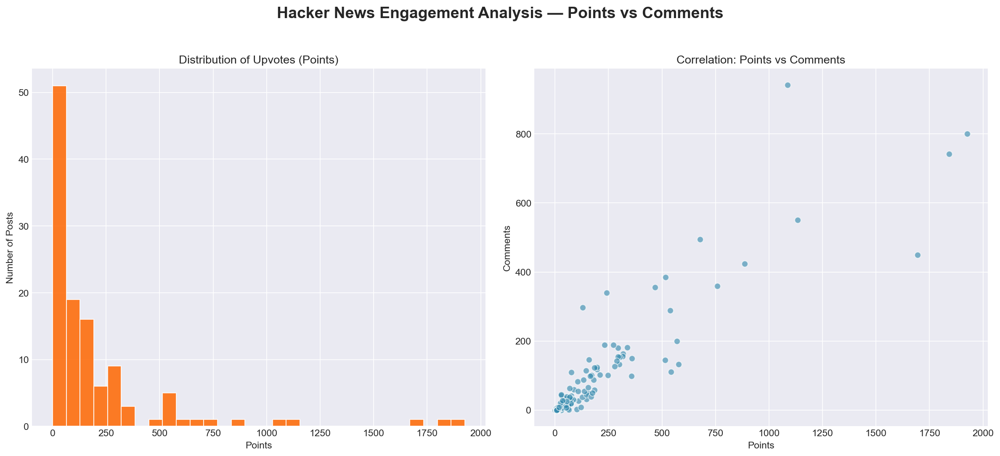
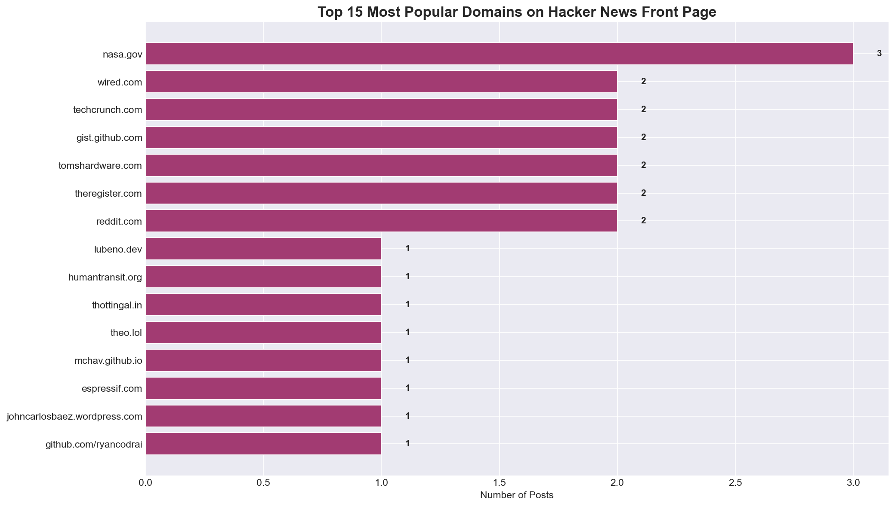
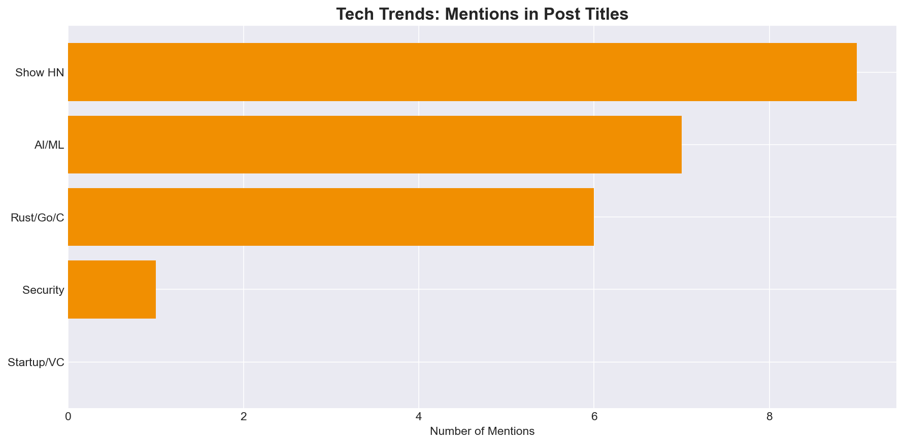

<p align="center">
  
</p>

<h1 align="center">End-to-End ETL Web Scraping Pipeline</h1>

<p align="center">
  <strong>Automated Data Engineering Pipeline scraping YCombinator's Hacker News</strong><br>
  <em>Extraction, Transformation, and Loading (ETL) architecture built for real-time data analysis</em>
</p>

<p align="center">
  
  
  
  
  
</p>

---

## 🏗️ Why Build an ETL Pipeline?

Most data analysts rely on pre-cleaned CSV files (like Kaggle datasets) to build analysis. However, real business data is often trapped on websites, APIs, or internal portals, filled with unstructured text and missing values.

This project demonstrates **Data Engineering fundamentals**: building an automated pipeline that can Extract data from the wild, Transform it into a clean structure using Python, and Load it into a Relational Database for SQL querying.

---

## ⚙️ Architecture & Data Flow

The script `scraper/etl_pipeline.py` executes three distinct phases automatically:

### 1. EXTRACT (BeautifulSoup & Requests)
- Scrapes the front pages of `news.ycombinator.com`.
- Navigates complex nested HTML `<tr>` and `<td>` tables to locate titles, domains, points, and comments.
- **Production Guardrails:** Includes User-Agent headers, error handling for failed requests, and `time.sleep()` delays to avoid rate-limiting algorithms.

### 2. TRANSFORM (Pandas & Regex)
- Converts raw extracted dictionaries into a Pandas DataFrame.
- Uses **Regular Expressions (`re`)** to extract integers from dirty strings (e.g., converting `"150 points"` → `150`).
- Normalizes missing values and manages schema data types.
- Generates execution timestamps (`scraped_at`) to track data freshness.

### 3. LOAD (SQLite Upsert Logic)
- Connects to a local SQLite database (`hacker_news.db`).
- Creates the `fact_posts` table with strict data typing.
- **Upsert Architecture:** It checks if a `post_id` already exists. If it does, it *updates* the points/comments (to capture live engagement changes). If not, it *inserts* the new record. This allows the script to be safely run daily via a Cron job.

---

## 📊 Analytical Insights

Once the data resides in the Data Warehouse (SQLite), the `notebooks/generate_analytics.py` script queries the database to extract business insights.

### 1. Engagement Dynamics (Points vs Comments)

<p align="center"></p>

- **Finding:** Upvote distribution is heavily right-skewed. The vast majority of posts linger below 100 points, while a tiny fraction achieve viral status (300+).
- **Correlation:** There is a strong positive correlation between upvotes and comments, indicating that highly upvoted technical content drives significant community debate.

### 2. Top Sourced Domains

<p align="center"></p>

- **Finding:** Excluding internal `ycombinator.com` posts, the front page is dominated by major platforms like GitHub (open source projects), NYTimes (tech policy), and specialized engineering blogs.

### 3. Tech Trend Analysis (NLP / Keyword Extraction)

<p align="center"></p>

- Using Regex to scan post titles for trending technologies.
- **Finding:** Artificial Intelligence (AI, LLMs, ChatGPT) dominate conversation volume, significantly outpacing traditional programming language discussions (Rust/Go/C++) and Security vulnerability reports.

---

## 🚀 How to Run the Pipeline

You can run this pipeline yourself to scrape the absolute latest news and build your own database.

```bash
# Clone the repo
git clone https://github.com/AnkushGit14/HackerNews-ETL-Pipeline.git
cd HackerNews-ETL-Pipeline

# Install dependencies
pip install -r requirements.txt

# Execute the pipeline (Extract -> Transform -> Load)
cd scraper
python etl_pipeline.py

# Query the DB and generate charts
cd ../notebooks
python generate_analytics.py
```

---

## 🗄️ SQL Highlights

The `sql/hn_analytics.sql` file contains analytical queries that can be run against the generated database:

```sql
-- Finding the highest engagement posts using subqueries for percentile thresholds
SELECT title, domain, points, comments
FROM fact_posts
WHERE points > (
    SELECT points FROM fact_posts 
    ORDER BY points DESC 
    LIMIT 1 OFFSET (SELECT CAST(COUNT(*) * 0.05 AS INTEGER) FROM fact_posts)
)
ORDER BY points DESC;
```

---

## 👨‍💻 Author

**Ankush Kumar Jaiswal** — NIT Raipur | Data Analyst

[](https://www.linkedin.com/in/ankush-jaiswal-nitrr/)
[](https://github.com/AnkushGit14)

---

## 📄 License
This project is licensed under the MIT License.
